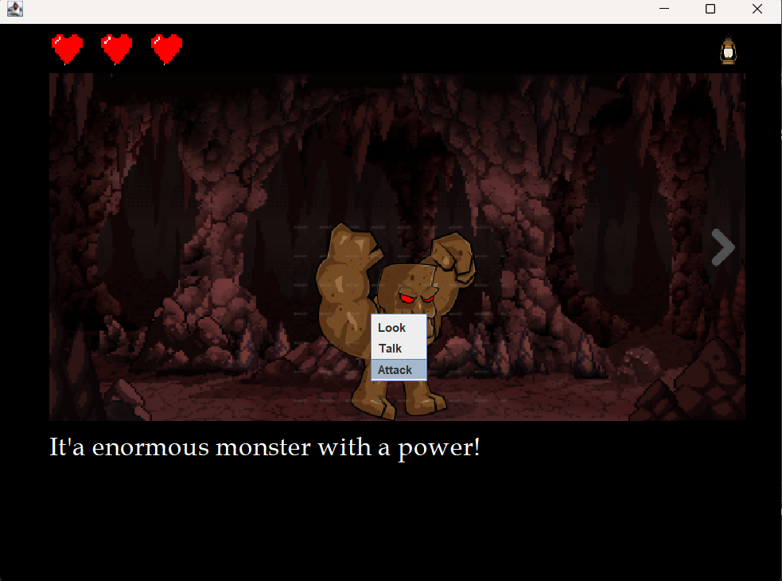

# LƯU CÁC BÀI TẬP VỀ JAVA PROGRAMMING

#### **Thần chú của Java:**

> _**Write Once, Run Anywhere**_

---

## **Lab 1-8: Thực hành Java Cơ bản**

| LAB | CONTENT                                  | STATUS         |
| :-- | :--------------------------------------- | :------------- |
| 1   | LÀM QUEN VỚI LẬP TRÌNH JAVA              | _**DONE**_     |
| 2   | KIỂU, TOÁN TỬ, LỆNH IF VÀ SWITCH         | _**DONE**_     |
| 3   | MẢNG VÀ LỆNH LẶP                         | _**DONE**_     |
| 4   | LỚP VÀ ĐỐI TƯỢNG                         | _**DONE**_     |
| 5   | ARRAYLIST                                | _**DONE**_     |
| 6   | CHUỖI VÀ BIỂU THỨC CHÍNH QUI             | _**PROGRESS**_ |
| 7   | KẾ THỪA                                  | _**PROGRESS**_ |
| 8   | KIẾN THỨC NÂNG CAO VỀ PHƯƠNG THỨC VÀ LỚP | _**PROGRESS**_ |

---

## **I. Game Awesome Quest**

## 1. Giới thiệu:

Đây là game được xây dựng dựa theo thể loại **Point and Click**, code thuần bằng Java Swing, không sử dụng WindowBuilder

## 2. Chi tiết

- Đây là giao diện chính của game

- Khi click vào một item nó sẽ hiển thị ra các Option để lựa chọn, mỗi Option sẽ có một chức năng khác nhau, nhưng nhìn chung 2 chức năng đầu là Look và Talk chức năng thứ ba mới là yếu tố của trò chơi.

- Ví dụ, khi ta chọn vào Rest ở House thì nó sẽ hồi cho ta 1 HP.

- Ở **Chest** thì ta có thể lấy được **Sword** để có thể đánh bại **Dinosaur**, nếu không có **Sword** thì sẽ bị trừ 1 **Heart** ta tấn công **Dinosaur** .
  _**!Note**: Khi đánh bại **Dinosaur** sẽ nhận được **Shield**_.

- Nhấn vào bụi bỏ để thu được **Lantern**.
  _**!Note**: Phải có được **Lantern** mới vào được **Cave**_.

- Giao diện khi vào **Cave**

- Điều kiện để thắng được **BOSS** là phải thu thập đủ **Sword** and **Shield**.

- Giao diện khi đánh bại được BOSS

- Giao diện khi đánh bại được BOSS, đồng thời ta có thể chọn bất kì vị trí nào để bắt đầu lại trò chơi!

_**Xem rõ hơn về game(video):**_ https://www.youtube.com/watch?v=k8KqnI5EKjM&ab_channel=LinhL%C6%B0%C6%A1ng

_**Lương Văn Linh - 63134463**_
